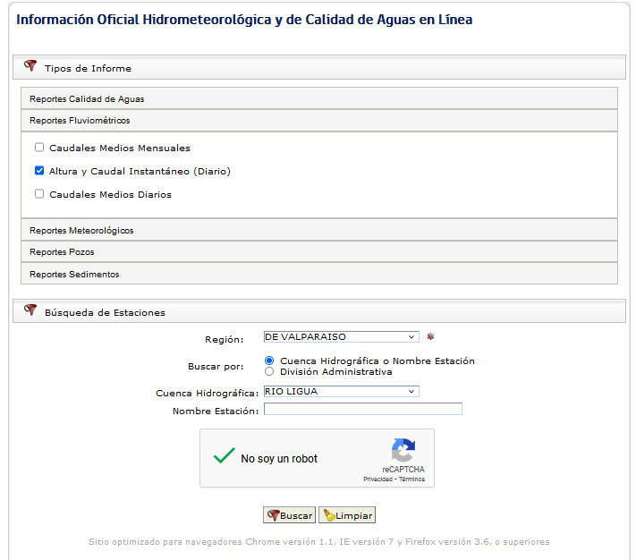
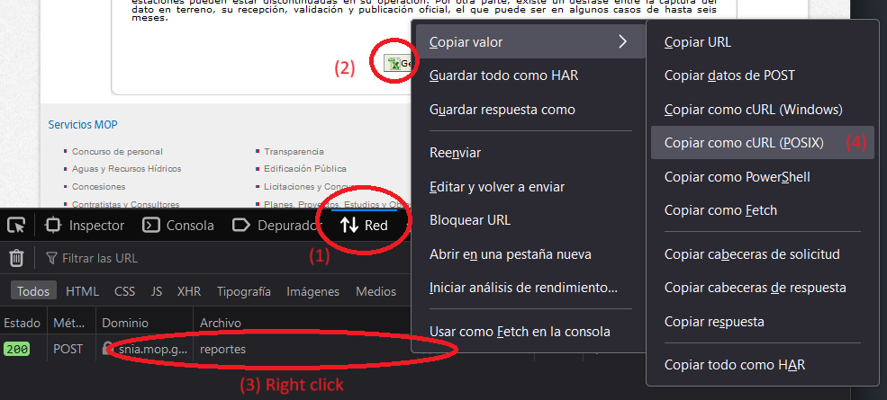

## queryDGA

Paquete simple con programas para descargar información hidrometeorologica del servidor público de la Direccion General de Aguas (DGA).

La idea es la siguiente:

1) Ir a https://snia.mop.gob.cl/BNAConsultas/reportes
2) Escoger una variable y región
3) Resolver el captcha manualmente
   
4) Escoger una estación y un intervalo de tiempo cualquiera
5) Inspeccionar el botón de descarga con el navegador
6) Ir a las opciones de red (network) y apretar el botón de descarga. Del POST request llamado "reportes" copiar la instrucción dada al servidor como un cURL de Linux (POSIX o bash dependiendo de lo que indique tu navegador)
   
7) Ir al sitio [https://curlconverter.com/json/](https://curlconverter.com/json/) y convertir la orden codificada en el cURL como un json
8) Copiar el contenido del json en el archivo DGA_cURL.json de este repositio. El .json debiese tener algo como lo siguiente:

   ```text
           "filtroscirhform": "filtroscirhform",
           "filtroscirhform:regionFieldSetId-value": "true",
           "filtroscirhform:j_idt30-value": "filtroscirhform:j_idt45",
           "filtroscirhform:j_idt59": "on",
           "filtroscirhform:panelFiltroEstaciones-value": "true",
           "filtroscirhform:region": "5",  <------------------------ USER SELECTED REGION IN THE WEBPAGE (NOT LOOPABLE)
           "filtroscirhform:selectBusqForEstacion": "1",
           "filtroscirhform:cuenca": "-1",
           "filtroscirhform:estacion": "",
           "g-recaptcha-response": "",
           "filtroscirhform:j_idt100-value": "true",
           "filtroscirhform:j_idt181": "on",           <------------------------ STATION ID (LOOPABLE)
           "filtroscirhform:j_idt102-value": "true",
           "filtroscirhform:fechaDesdeInputDate": "01/01/1990",     <------------------------ START DATE (LOOPABLE)
           "filtroscirhform:fechaDesdeInputCurrentDate": "01/2011", 
           "filtroscirhform:fechaHastaInputDate": "31/12/2010",
           "filtroscirhform:fechaHastaInputCurrentDate": "12/2011",     <------------------------ END DATE (LOOPABLE)
           "filtroscirhform:generarxls": "Generar XLS",
           "javax.faces.ViewState": "-1017629065942579622:-7489475727910640494"
   ```
9) Ver el archivo example.ipynb para ver como descargar y postprocesar planillas de datos de la DGA

---

### Requisitos (paquetes)

* requests
* numpy
* pandas
* openpyxl
* tqdm
* json
